<h1 align="center"> hackergame2024 write_up</h1>

<p align="right">——刚入坑ctf的大二萌新</p>

本次成绩:
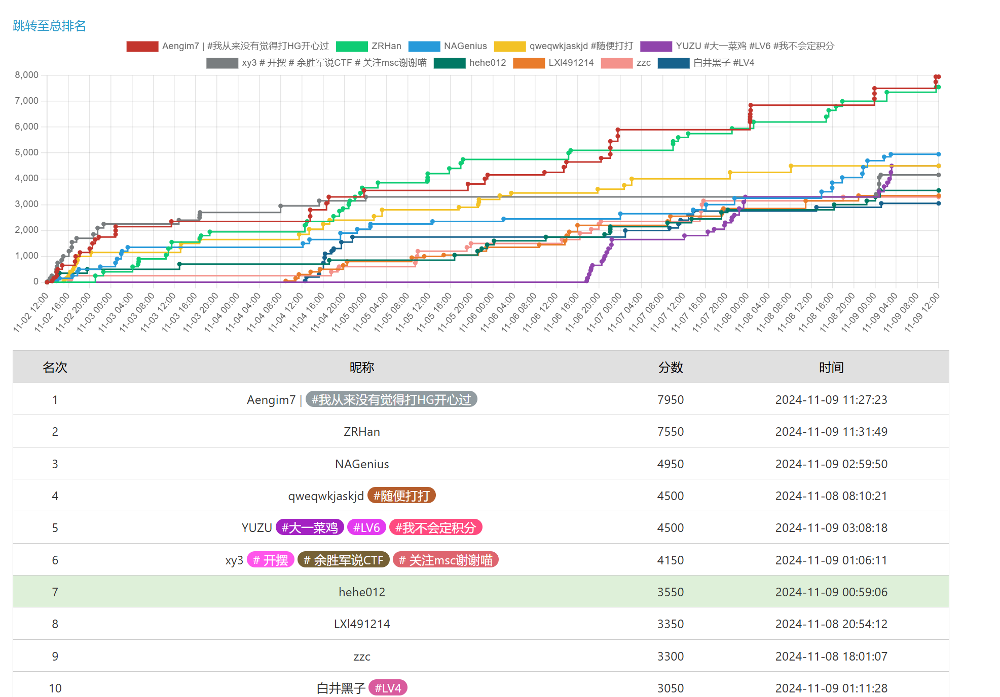</img>
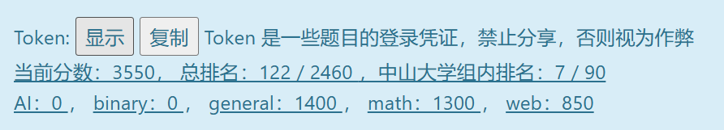</img>
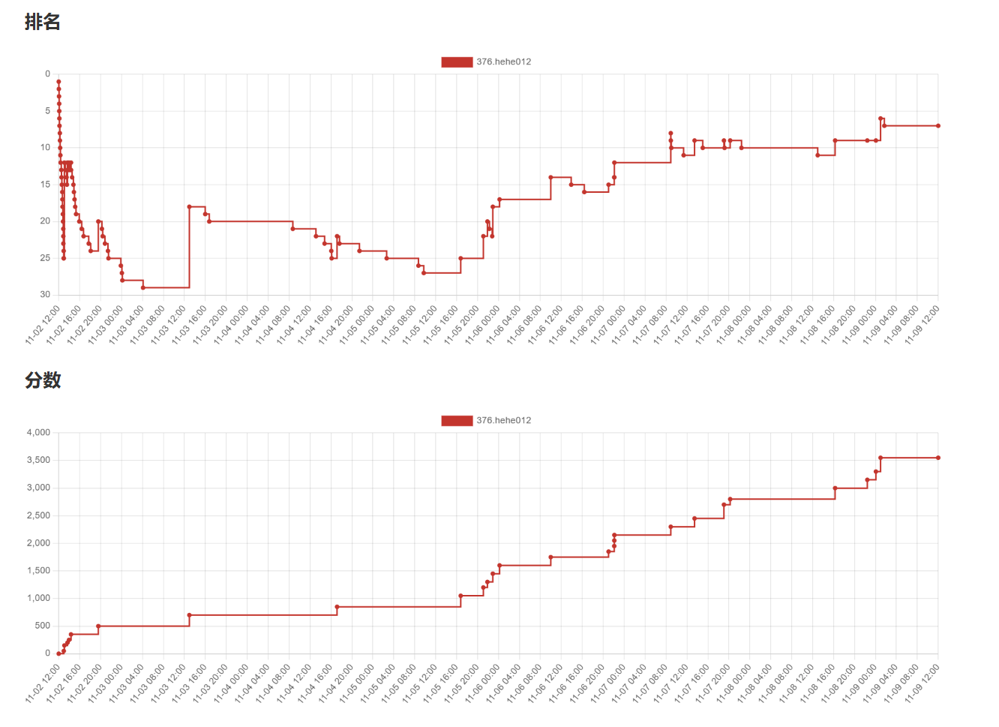</img>
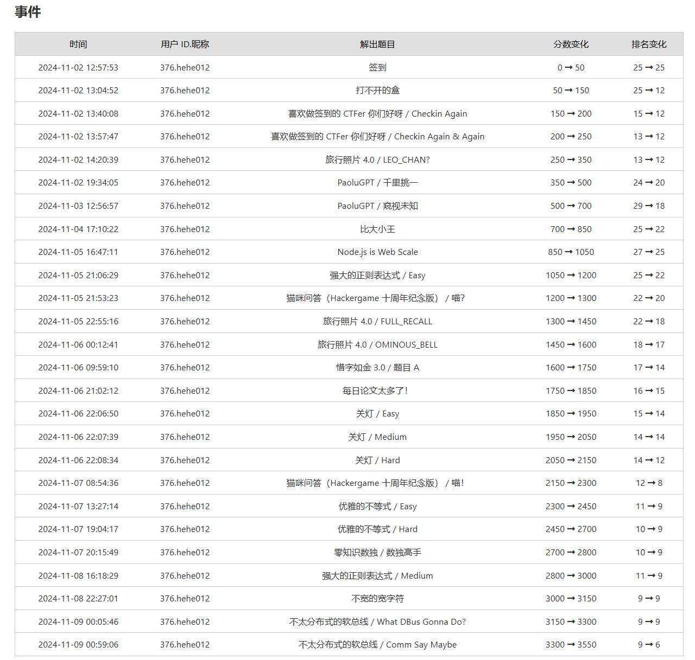</img>
前六名才有奖，最后一天刚达到第六马上被反超了。。<br/>
第一次接触ctf比赛,边学边做题的感觉很过瘾，一场比赛下来学会了很多新东西

## 1.签到

打开网页后点击提交，发现是用get提交<code>pass=false</code>,改成<code>pass=true</code>后得到flag
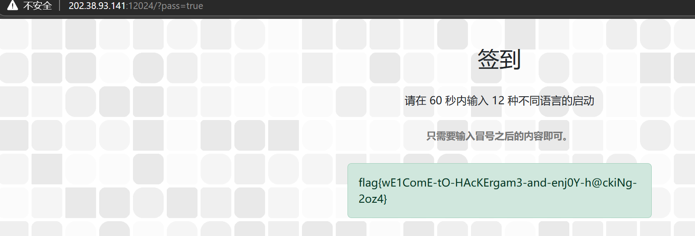</img>

## 2.喜欢做签到的 CTFer 你们好呀

输入`help`后给出如下指令<br/>
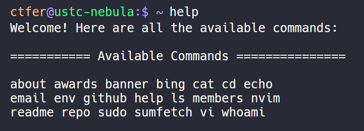</img>

输入`env`得到第一个flag<br/>
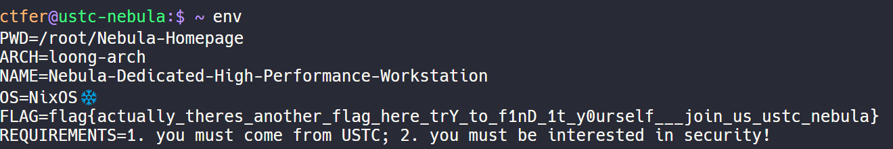</img>

使用`ls -al`查看隐藏文件看到.flag<br/>
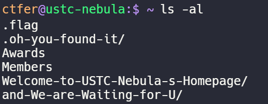</img>

使用`cat .flag`得到第二个flag<br/>
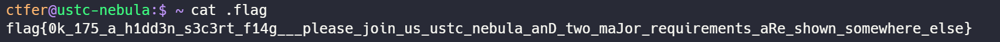</img>

## 3.猫咪问答（Hackergame 十周年纪念版）

### 第一个问题: 在 Hackergame 2015 比赛开始前一天晚上开展的赛前讲座是在哪个教室举行的？<br/><br/>
在网上搜索，找到了比赛安排<br/>
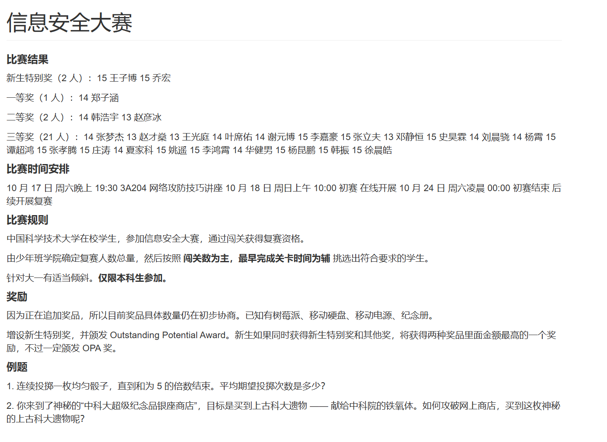</img>
答案为3A204<br/>

### 第二个问题:
众所周知，Hackergame 共约 25 道题目。近五年（不含今年）举办的 Hackergame 中，题目数量最接近这个数字的那一届比赛里有多少人注册参加？（30 分）<br/><br/>
在github历年writeup总结中可以看到历年题目数量和参加人数<br/>
答案为2682<br/>

### 第三个问题:Hackergame 2018 让哪个热门检索词成为了科大图书馆当月热搜第一？<br/>
同样在github的2018年总结中<br/>
答案为“程序员的自我修养”<br/>

### 第五个问题:10 月 18 日 Greg Kroah-Hartman 向 Linux 邮件列表提交的一个 patch 把大量开发者从 MAINTAINERS 文件中移除。这个 patch 被合并进 Linux mainline 的 commit id 是多少？<br/>

在github的commit翻到10月18的提交<br/>
答案为6e90b6<br/>

### 第四个问题:在今年的 USENIX Security 学术会议上中国科学技术大学发表了一篇关于电子邮件伪造攻击的论文，在论文中作者提出了 6 种攻击方法，并在多少个电子邮件服务提供商及客户端的组合上进行了实验？<br/><br/>
### 第六个问题:大语言模型会把输入分解为一个一个的 token 后继续计算，请问这个网页的 HTML 源代码会被 Meta 的 Llama 3 70B 模型的 tokenizer 分解为多少个 token？<br/><br/>

判断这两个问题答案不会太大，直接在python上用程序尝试，程序代码如下
````python
from selenium.webdriver.common.by import By
import time
import json
from selenium import webdriver

driver = webdriver.Firefox()
url="http://202.38.93.141:13030/"

driver.get(url)
driver.find_element(By.NAME, "token").send_keys("376:MEUCIQC2OimX3zd33M/9D2QVboQ2G/Hw+xMHfDW9J7K1x1hH/gIgXSF+7K78yKPfH4Mt/n5z9xHCQ7l0/vRm9g5LuvRatyc=")
driver.find_element(By.XPATH, "/html/body/form/input[2]").click()
driver.find_element(By.NAME,"q1").send_keys("3A204")
driver.find_element(By.NAME,"q2").send_keys("2682")
driver.find_element(By.NAME,"q3").send_keys("程序员的自我修养")
driver.find_element(By.NAME,"q4").send_keys("336")

submit=driver.find_element(By.XPATH,"/html/body/form/div[position()=last()]/input")
submit.click()
result = driver.find_element(By.XPATH,"/html/body/form/div/div")
od=result.text
nd=result.text
print(od)
i=0
while nd == od:
   i=i+1
   driver.find_element(By.NAME, "q6").clear()
   driver.find_element(By.NAME, "q6").send_keys(i)
   submit=driver.find_element(By.XPATH,"/html/body/form/div[position()=last()]/input")
   nd = driver.find_element(By.XPATH,"/html/body/form/div/div").text
   submit.click()
print(i)
time.sleep(100)
````
这里的是第六个问题的代码，第四个问题也类似<br/>
答案为336和1833<br/>
## 4.打不开的盒
在浏览器搜索即可在线打开并查看文件，可以看到中间的flag

## 5.每日论文太多了！
首先看到了一张图片上面的`flag here`,然后研究了半天，使用010editor等一系列工具都没找到异常，最后发现直接在pdf编辑器中把不透明度调到0就行了<br/>
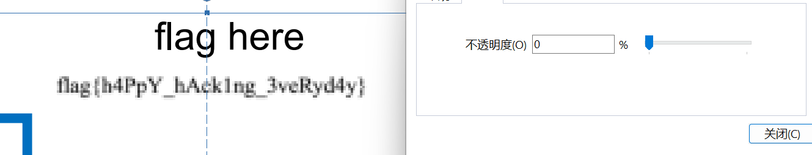</img>

## 6.比大小王
最开始想使用python中的selenium模块识别大小并点击，但是10秒只能完成40题<del>(体会到了小辕口算里小学生的恐惧)</del></br>
然后在控制台可以查看网页的逻辑，发现网页会先请求数据和开始时间，在答对100题后将json文件传递给服务器，在python中利用requests模块完成即可，代码如下
````python
import requests
import time
import json

url="http://202.38.93.141:12122"
cookie = {
    "session":".eJx1VF1PwkAQ_CvmXrnY27v2Ppr4BGoRiYJfJMaHqoBEPhIpiBD-uyUxcecSnprJ3u3Mzux1J8blbCjynVhW5Vd1PzkAckZZF5RWp8o5KdbldDVcivx5J06q-uOlednLP0AArAwMKUn6H2qpWE1LYtBKx2oBTnpJDKVQkxauUQb3GHld40cz6UG1QdWOK6NoJIYIjmackAxoU-gZpWCFhp72WBcNQyBdLYygZwpdMrCCwDUN9yycRGXkMRc2vAPZhCk5CJDTe7Q3BRgFalFOChtUVz1MxbX6OERmjkESNE5JrAWk4Jlm0VwoVUGKKU8RM7WgGjoGkEIRNNATZeOyE64Gh1ERPYWRMgjDAD9cg8336Bk-tXprAjDgi6XopxBg4KNhG5wBIwswekRgjhAcLGQwBZ0O28A2OVhKHf0g1DEt9kBeQ1EtPodzkQvjbN49f2i2e019M5kNzPbdmG4SWrr3-Lro6cuk-G5susWo9RSuXIc29FEk4_Z4cHfRcB3nfzq3oyLtVsk824ZN0ey5qUrW_VkYZ9erdb-sft7OxP4XJzGjrg.ZygQ5w.go4L-oc-NSzkQai4lesSOCa-RmY"
}
headers = {
    "Content-Type":"application/json",
    "origin":url
}
s=requests.session()
s.get(url,cookies=cookie)
resp=s.post(url+"/game",cookies=cookie,headers=headers,data="{}")
current_timestamp = time.time()
start_time = resp.json()["startTime"]
wating_time = start_time - current_timestamp
print(wating_time)

ans={"inputs":[]}

for i in range(100):
    if(resp.json()["values"][i][0]<resp.json()["values"][i][1]):
        ans["inputs"].append("<")
    else:
        ans["inputs"].append(">")

data1=json.dumps(ans, indent=4, sort_keys=True, ensure_ascii=False)
time.sleep(wating_time+5)
resp1 = s.post(url+"/submit",cookies=cookie,headers=headers,data=data1)


print(resp1.text)
````
运行程序即可得到flag
## 7.旅行照片 4.0
</img>
### 问题 1: 照片拍摄的位置距离中科大的哪个校门更近？
搜索图片上的科大硅谷，即可得到位置，然后查看方向即可
### 问题 2: 话说 Leo 酱上次出现在桁架上是……科大今年的 ACG 音乐会？活动日期我没记错的话是？
在浏览器直接搜索，可以找到日期
</img>
### 问题 3: 这个公园的名称是什么？（不需要填写公园所在市区等信息）
注意到垃圾筒上写的"六安园林",可以将范围缩小到六安，然后直接在高德地图搜索公园，可以找到相似的中央公园
</img>
### 问题 4: 这个景观所在的景点的名字是？
人很多，应该是热门的景点，直接使用ai查找图片，可以查到图片在三峡大坝附近，然后直接百度查找即可找到
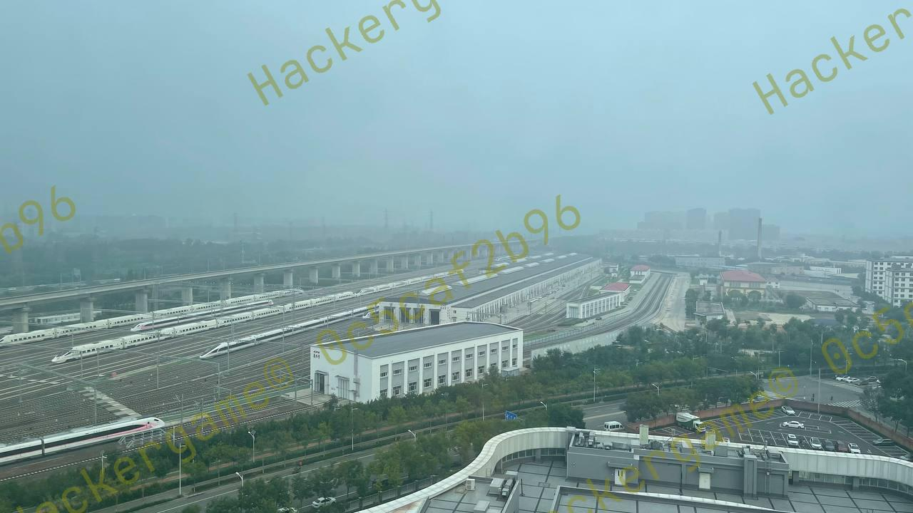</img>

### 问题 6: 左下角的动车组型号是？
题目告诉我们这是四编组动车，在浏览器上搜索可以得到下图列车最相似
</img>
编号为CRH6F-A
### 问题 5: 距离拍摄地最近的医院是？（无需包含院区、地名信息，格式：XXX医院）
搜索得到沿线车站
</img>
然后在高德地图上逐个搜索附近医院即可
## 8.不宽的宽字符
程序的错误是输入了宽字符然后使用普通char(4bytes)指针指向宽字符(8bytes)，导致无法正确打开文件，输入`Z:\theflag\0`对应的宽字符即可<br/>python代码为`print(b"\x5A\x3A\x2F\x74\x68\x65\x66\x6C\x61\x67\x0A\x00".decode("utf16"))`
## 10.Node.js is Web Scale
先查看给出的服务端代码，只有cmd指令能够获取到服务器文件信息，但是cmd指令只有两条，上网查询发现可以污染对象的原型来使cmd有新的命令
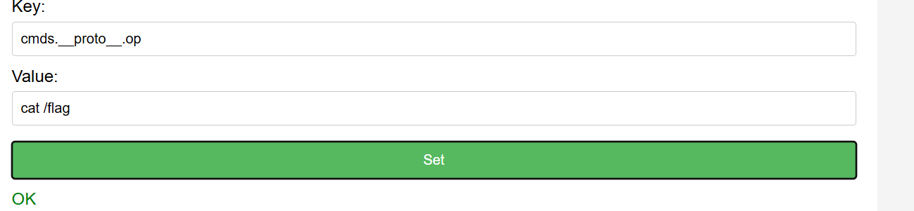</img>
然后使用cmd=op即可<br/>
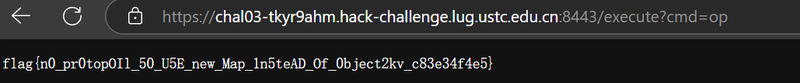</img>

## 11.PaoluGPT

首先看到网站内的很多数据，显然不能一条一条慢慢看，使用python中的request模块将信息汇总到文件中<br/>
````python
from bs4 import BeautifulSoup
import re
import requests

url="https://chal01-xt2u78vq.hack-challenge.lug.ustc.edu.cn:8443"
cookie={
    "_ga":"GA1.1.1175949431.1730520231",
    "_ga_R7BPZT6779":"GS1.1.1730977880.8.0.1730977880.60.0.477171308",
    "session":"eyJ0b2tlbiI6IjM3NjpNRVVDSVFDMk9pbVgzemQzM00vOUQyUVZib1EyRy9Idyt4TUhmRFc5SjdLMXgxaEgvZ0lnWFNGKzdLNzh5S1BmSDRNdC9uNXo5eEhDUTdsMC92Um05ZzVMdXZSYXR5Yz0ifQ.Zy8eoA.-OMVpUW6Tk11LSIfQDTXsUyJbjw"
}
resp = requests.get(url+"/list",cookies=cookie)
resp.encoding = "utf-8"
page = BeautifulSoup(resp.text, "html.parser")
print(page.text)

li=page.find_all("li")

with open("data/"+"text"+".txt","w",encoding="utf-8") as f:
    for i in li:
        href=i.a["href"]
        http=url+href
        resp1 = requests.get(http,cookies=cookie)
        resp1.encoding = "utf-8"
        page1 = BeautifulSoup(resp1.text, "html.parser")
        f.write(page1.text)
````
然后ctrl+f即可得到第一个flag<br/>
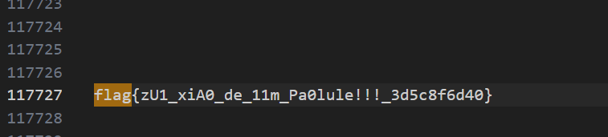</img><br/>
然后查看服务端代码,发现只显示了`shown=True`的文件,利用mysql中的union显示`shown=false`的文件，设置`conversion_id=' UNION select title, contents from messages where shown='0`绕过mysql的语句<br/>
在网页底部得到第二个flag
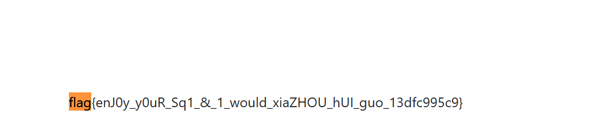</img>

## 12.强大的正则表达式
### 任务一:给出可以匹配16的倍数的正则表达式
网上找到被16整除的特征为最后4也被16整除，编写python程序即可实现
````python
print("((0|1|2|3|4|5|6|7|8|9)*(0000|",end="")
for i in range(1000):
    if i==0:
        continue
    if i*16<100:
        print("00"+str(16*i),end="")
    elif i*16<1000:
        print("0"+str(16*i),end="")
    else:
        print(16*i,end="")
    if 16*(i+1)>=10000:
        break
    print("|",end="")
print("))|(",end="")
for i in range(1000):
    print(16*i,end="")
    if 16*(i+1)>=1000:
        break
    print("|",end="")
print(")")
````
### 任务二：给出可以匹配整除13的二进制数
上网找了一下思路，二进制数可以看作一个接受0和1，有13个状态的有限状态自动机，可以化成一张图，每个点有两条出边和两条入边，我使用了矩阵来储存,mp[i][j]表示从i到j接受的正则表达式。<br/>
考虑这张图上的一个点，如果将其删除，需要连接所有到达它的点和它指向的点。对于i->j->k,新的路径mp[i][k]+=|(mp[i][j]+mp[j][j]*+mp[j][k])
````c++
#include<iostream>
#include<vector>
#include<string.h>
#include<algorithm>
#include<set>
#include<queue>
using namespace std;
const int N=13;
int a[N+1],f[N+1];
string mp[N][N];
void bfs(){
    for(int x=N-1;x>0;x--){
        for(int i=0;i<N;i++){
            int pre=i;
            if(mp[pre][x]==""||pre==x)continue;
            for(int j=0;j<N;j++){
                int nxt=j;
                if(mp[x][nxt]==""||nxt==x)continue;
                if(mp[x][x]!="")mp[pre][nxt]+="(("+mp[pre][x]+"9)("+mp[x][x]+"9)*("+mp[x][nxt]+"9))|";
                else mp[pre][nxt]+="(("+mp[pre][x]+"9)("+mp[x][nxt]+"9))|"; 
            }
        }
    }
}
int main(){
    freopen("py1_out.txt","w",stdout);
    for(int i=0;i<N;i++){
        mp[i][i*2%N]="0|";
        mp[i][(i*2+1)%N]="1|";
//        cout<<i<<" "<<i*2%N<<" "<<(i*2+1)%N<<endl;
    }
    bfs();
    cout<<"("<<mp[0][0]<<"9)*";
}
````
### 任务三不会
## 13.优雅的不等式
### 任务：给出有理数p/q，找出f(x)使f(x)在(0,1)上的积分为pi-p/q且在[0,1]上有f(x)>=0
上网搜索，找到这篇文章
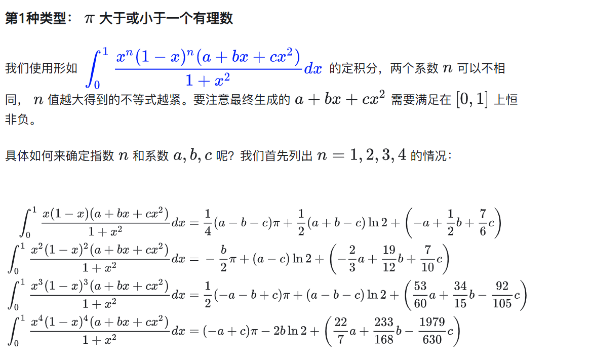</img>
但是题目要求精度极高，四次方的逼近显然不够，使用sympy计算更高次方的积分算式（这个工具是真的nb）,由于题目有长度要求，经过不断尝试后78次方的逼近成功通过测试，下面是交互代码
````python
from subprocess import Popen, TimeoutExpired, PIPE
import time
import json
import re
from fractions import Fraction

server="202.38.93.141"
port="14514"

def tostr(f):
    return repr(f.numerator)+"/"+repr(f.denominator)

with Popen(args=["nc",server,port], shell=True, stdin=PIPE, stdout=PIPE, stderr=PIPE) as proc:
    try:
        out=proc.stdout
        stdin=proc.stdin
        print(out.readline())
        stdin.write("376:MEUCIQC2OimX3zd33M/9D2QVboQ2G/Hw+xMHfDW9J7K1x1hH/gIgXSF+7K78yKPfH4Mt/n5z9xHCQ7l0/vRm9g5LuvRatyc=\n".encode())
        stdin.flush()
        ans0="4/(1+x**2)-4+4*x\n"
        stdin.write(ans0.encode())
        stdin.flush()
        pat=r"\d+"
        cnt=0
        t=1
        while cnt<5:
            t+=1
            str=out.readline()
            print(str)
            str=str.decode()
            lst=re.findall(pat,str,re.S)
            print(lst)
            if len(lst)!=2:
                cnt+=1
                continue
            else:
                cnt=0
            p=int(lst[0])
            q=int(lst[1])
            x=Fraction(-p,q)
            l=Fraction(1,281474976710656)
            i=Fraction(2550061106995137631976969274315728586969500974297264997061570996998918566591,13383980378514771933336080032002124880230698703723978719059454000)
            j=Fraction(-617592116366255342908562275953629730690505430695654160579958174115814463697,1430349048085548145547367331664349223841448716428516809670476000)
            k=Fraction(-180994391409691052540860839090221242384363315083485806753464895657590759271,949947974424420973568609658690928393397929338374622359354581500)
            b=Fraction(1,137438953472)
            a=(x-j*b)/(i+k)
            c=a
            ans="x**78*(1-x)**78*("+tostr(a)+"+x*"+tostr(b)+"+x**2*"+tostr(c)+")/(1+x**2)\n"
            print(t/2)
            stdin.write(ans.encode())
            stdin.flush()
    except TimeoutExpired:
        proc.kill()
````
<del>其实早就关注了这个作者只是没有认真看这篇文章</del>
## 19.不太分布式的软总线
这题用chatgpt过了1和3
<del>其实如果早点想到用gpt可能做出更多题</del>
## 23.关灯
关灯游戏是关掉一个灯后旁边的灯也会改变状态，灯的状态可以表示为一个异或方程组，使用高斯消元即可O(n^9)解决问题可以解决前三问
````c++
#include<iostream>
#include<algorithm>
#include<stdio.h>
#include<string.h>
using namespace std;
const int n=5;
const int N=n*n*n;
bool a[N],p[N][N],q[N];
void Swap(int x,int y){
    if(x==y)return;
    swap(a[x],a[y]);
    for(int i=0;i<N;i++)swap(p[x][i],p[y][i]);
}

void Xor(int x){
    for(int i=0;i<N;i++){
        if(i==x)continue;
        if(p[i][x]){
            for(int j=x;j<N;j++){
                p[i][j]^=p[x][j];
            }
            a[i]^=a[x];
        }
    }
}

void print(){
    for(int i=0;i<N;i++)cout<<a[i];
    cout<<endl;
}

void printp(){
    for(int i=0;i<N;i++){
        for(int j=0;j<N;j++){
            cout<<p[i][j]<<"";
        }
        cout<<endl;
    }
    cout<<endl;
}

int main(){
    freopen("py1.txt","r",stdin);
    freopen("py1_out.txt","w",stdout);
    for(int i=0;i<N;i++)a[i]=getchar()-'0',q[i]=a[i];
    for(int i=0;i<n;i++){
        for(int j=0;j<n;j++){
            for(int k=0;k<n;k++){
                int now=i*n*n+j*n+k;
                p[now][now]=1;
                if(k<n-1)p[i*n*n+j*n+k+1][now]=1;
                if(k>0)p[i*n*n+j*n+k-1][now]=1;
                if(j<n-1)p[i*n*n+(j+1)*n+k][now]=1;
                if(j>0)p[i*n*n+(j-1)*n+k][now]=1;
                if(i<n-1)p[(i+1)*n*n+j*n+k][now]=1;
                if(i>0)p[(i-1)*n*n+j*n+k][now]=1;
            }
        }
    }
    printp();
    for(int i=0;i<N;i++){
        for(int j=i;j<N;j++){
            if(p[j][i]){
                Swap(i,j);
                break;
            }
        }
        Xor(i);
    }
   // print();
}
````